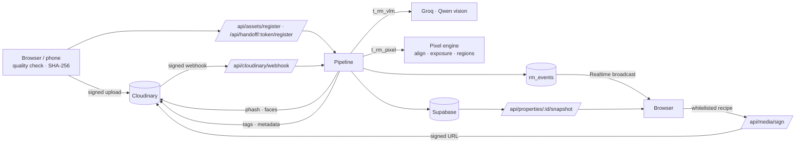

# RentalMove — every room remembers

> **Pixels to Products · Cloudinary AI Hackathon 2026 · Track 1: AI Media Pipelines**
>
> Photograph a home at move-in. Photograph it again at move-out. RentalMove lines the two up,
> shows exactly what changed, and gives tenant and owner the same sealed, signed evidence.

**Live demo:** [https://rental-move.vercel.app](https://rental-move.vercel.app) · **Demo logins:** one click on the sign-in page —
tenant *Alex Chen* (`alex.tenant@rentalmove.demo`) or owner *Sarah Jenkins* (`sarah.owner@rentalmove.demo`), password `DemoPassword123!`.
Guided tour: open `/welcome?present=1`.

---

## In 30 seconds

**At move-out the landlord says the damage is yours. RentalMove proves it was already there.**

Three things to try, each takes under a minute:

0. **"Your landlord says you broke it? Paste their message."** Sign in as the tenant (*Alex Chen*, one click), open **Landlord claim**, tap *"Shower glass is damaged, deducting ₹4,000..."*. RentalMove reads the message (English or Hinglish), finds that part of the bathroom in the move-in and move-out photos, answers **"Already there at move-in, 1 Jun 2024"** with both photos side by side, and drafts a polite reply you can edit, with an optional read-only link to the sealed record. If the damage is *new*, or there is no move-in photo, it says that instead of taking the tenant's side.
1. **"It was already there."** Sign in as the owner, open **Review**, pick the bathroom shower-screen finding: the move-out photo sits next to the same spot at move-in, marked *Matches move-in — already recorded at an earlier visit and not noticeably larger now.*
2. **"You can't fake it."** Open **`/verify`** (no login) and drop in `demo-assets/kitchen-move-out-ORIGINAL.jpg`: *Matches the photo on record.* Drop in `demo-assets/kitchen-move-out-EDITED.jpg`, where the damaged door was softened in an editor: *No record of this exact file.* Each photo's SHA-256 is taken on the phone before upload and checked again on the server.
3. **"Nothing private leaves the app, and nothing is invented."** Faces and private items are pixelated by Cloudinary in every copy that leaves the app; generative AI is confined to rental listings and never touches evidence.

And for a tenant with no landlord account: **`/kit`** records a home on move-in day with a guided shot list, no sign-up, and produces a sealed record they choose when to share.

---

## Why

Deposit disputes are among the most common fights between tenants and landlords, and they are
usually settled on blurry photos nobody can compare, prove or trust. RentalMove turns inspection
photos into a **visual property memory**: every room at every visit, aligned and searchable, with
changes detected, located and reviewed by people — never decided by the AI.

## What it does

| | |
|---|---|
| **Capture** | Browser or phone camera with a *ghost* of the move-in photo and a **live alignment guide** ("pan left · step back", match %, optional auto-shutter). Brightness and sharpness checked on the device. File **SHA-256-sealed on the device**, then uploaded **directly to Cloudinary** with a server-signed request. |
| **Phone handoff** | "Phone" shows a QR code; the phone captures with no login (15-minute HMAC token scoped to one room) and the photo **appears on the laptop live**. |
| **Understand** | Cloudinary fingerprint (perceptual hash + faces) → vision model (Groq · Qwen) says **what** is there → **pixel engine** (alignment, local exposure match, change regions) says **where**. Re-used photos are caught. |
| **Compare** | Slider, side-by-side, onion skin, and an in-browser **pixel diff** running the same engine as the server. AI comparison labels each change *new*, *worse* or *pixel-only*. |
| **Review** | Keyboard triage (A/R/E, J/K). "Was it there at move-in?" crops. **Tenant and owner each agree or dispute**, with a discussion thread per finding. |
| **Report** | Only human-reviewed findings, **boxes drawn by Cloudinary** into the evidence images, faces pixelated, SHA-256 for every photo. **Both parties sign the SHA-256 of the report's contents** — any later change breaks the signature. Share by expiring, revocable link; naming a recipient **watermarks every shared image**, so a leak traces back to its link. |
| **Size in cm** | Drag a line across something of known size (switch plate, tile, door) and every finding on that photo shows an approximate length and affected area. |
| **Growth trend** | Each finding's affected area = pixels at that spot that differ from move-in (same aligned diff as detection), measured now and at the previous visit → *new*, *grew ×3.4*, *about the same*. Built for mould and damp that spread. |
| **Everyday-use context** | Neutral guidance per finding ("light scuffs are commonly seen after 24 months"; "cracks are not typically produced by everyday use"), always with the disclaimer that it is not a finding of cause or responsibility. |
| **Repair loop** | Owner turns a finding into a work order (requested → in progress → repaired). The repair photo is uploaded signed to its own folder and **checked against the finding photo**: same view? is the change still detected at that spot? Every step is an event; repairs get their own report appendix. |
| **Smart checklist** | The vision model lists which room areas each photo shows; each room type has a checklist with *why it matters* ("mould usually starts on bathroom ceilings"). Gaps show on Capture, the room dossier, the report and in Ask. |
| **Photo-time check** | Cloudinary reads each file's EXIF: the capture time is compared with the visit it was filed under ("taken 24 months before this visit") and editing software is surfaced ("edited with Photoshop"). No time in the file is neutral, never an accusation; GPS is never stored. |
| **Hindi report** | The evidence report (and the public share page) switch to हिन्दी. Report wording is translated by hand; finding text is machine-translated once and cached, and every translated report says the English version is authoritative — signatures cover the English content. |
| **Voice notes** | Record a note on any finding; the browser transcribes it (English or Hindi), the audio goes to Cloudinary with a signature scoped to that finding, and the discussion shows a player plus the editable transcript. |
| **"Not sure" bucket** | Findings with weak evidence are flagged *Not sure* with the reason instead of being presented as findings, and the model may abstain on a photo it cannot judge ("too dark") rather than guess. Pixel-only changes are shown as *undescribed change*, not doubted. |
| **Private items hidden** | Letters, bills, screens and personal photos are pixelated by Cloudinary (`e_pixelate_region`) in every copy that leaves the app — share links, report images, listing photos — while the original stays untouched. Areas come from Cloudinary OCR when the add-on is active (capped at 45 scans/month), otherwise from the vision model confirmed and snapped onto text-like pixels, or from a person drawing a box. Only geometry is stored, never the text. A warning shows if a hidden area would cover a finding, and "Preview shared copy" shows exactly what a recipient gets. |
| **Right photo, right room** | Every upload is checked against earlier photos of the room it was filed under (aligned pixel match + Cloudinary perceptual hash, no model call): *matches*, *doesn't match* (kept as a record, but out of review, comparisons, the report and share links), or *unclear — please confirm*. All photos of a room per visit are shown; the best match is used for comparison. A **visit completeness** panel lists missing rooms, unmatched photos, time warnings and checklist gaps, each linking to the room. |
| **Who decides** | Only the person who ran an inspection accepts, rejects or edits its findings; the other party agrees or disputes — so neither side can remove the other's evidence from the report. |
| **Free move-in kit** | A tenant with **no account** opens `/kit`, picks the home's rooms, and the phone walks them through a **shot list per room** (whole room, then ceiling / floor / sink… with *why it matters*) plus optional close-ups of existing damage. Photos go straight to Cloudinary; each is fingerprinted (SHA-256) on the phone **and re-checked on the server**; one file cannot fill two shots. Sealing fingerprints the whole kit and freezes it; the tenant gets a **read-only report link** to send by WhatsApp or email (or print as PDF) and can delete the kit and its photos at any time. Move-in photos are not sent to the vision model — the shot list already says what each photo shows. |
| **"Film a room" video pipeline** | Instead of taking 40 photos, tenants can film a 30–45s continuous video walk per room. Videos upload signed directly to Cloudinary. Serverless frame sampling uses Cloudinary `so_<sec>` transformations on the edge (no FFmpeg needed), filters out blur and dark frames, deduplicates near-identical angles via perceptual hashing, and auto-assigns the sharpest frames to room checklist items. |
| **Verify** | Public page: drop any photo — it is hashed in the browser (never uploaded) and checked against the record. |
| **Memory · Map · Timeline · Room time machine** | Every room × every visit; a floor plan with camera pins; a scrubber that ages a room from move-in to move-out. |
| **Ask RentalMove** | Plain questions answered only from the property's records, each answer citing the exact photo crops. |
| **Re-let studio** | The same originals become listing photos with **Cloudinary generative AI** — watermarked *AI-ALTERED · NOT EVIDENCE* in the pixels, owner-only, never attachable to a report. |
| **Media lab** | Live Cloudinary transformation playground on real assets, with measured bytes, format and time. |

## Cloudinary as the media pipeline (Track 1)

| Capability | Where | How |
|---|---|---|
| **Signed direct uploads** (browser/phone → Cloudinary) | `api/uploads/sign`, `(studio)/capture`, `h/[token]`, `api/handoff/*` | Folder `properties/{property}/{inspection}/{room}`; tags `room:*`, `insp:*`; the API secret never reaches the browser. |
| **Upload-triggered processing** | `api/cloudinary/webhook` | Signature-verified notifications register uploads from any client (registration is idempotent). |
| **Perceptual hash + face detection** | `lib/fingerprint.ts` | Admin API `phash` finds re-used photos (confirmed on aligned pixels); `faces` marks photos that need pixelation. |
| **Tags + structured metadata** | `lib/pipeline.ts`, `lib/tags.ts` | Written after analysis and every review, so the **Search API** filters by room, visit, issue and review state. |
| **Search API** | `api/search`, `(studio)/search` | Plain language → whitelisted filter → safe expression (shown verbatim). Year filters use capture dates. |
| **Matched frames** | `lib/cloudinary-urls.ts` (`t_rm_matched`) | `c_fill,g_auto` + `e_auto_brightness` + `e_auto_contrast` — the same crop and exposure for both photos before the model compares them. |
| **Evidence renditions** | `lib/recipes.ts` (`evidence`), `lib/shared-report.ts` | Finding boxes and labels drawn **by Cloudinary** (`l_` pixel layers + `l_text`) — authentic evidence images, not CSS overlays. |
| **Privacy** | `t_rm_privacy`, `t_rm_shared` | `e_pixelate_faces` on everything shown in a report or share link. Evidence is pixelated, never generatively edited. |
| **Per-recipient watermarks** | `lib/shared-report.ts` | `l_text` "Shared with {recipient} · {link}" burned into shared images. |
| **Generative AI** | `(studio)/relet`, `lib/recipes.ts` | `e_gen_remove:prompt_person`, `e_enhance`, `g_auto` channel crops, plus an *AI-ALTERED* `l_text` label — owner-only and signed. |
| **Named transformations** (`t_rm_*`) | `lib/cloudinary-urls.ts`, `scripts/provision-named-transformations.ts` | Every fixed rendition is a named transformation **allowed under Strict Transformations**. |
| **Signed URLs** | `lib/recipes.ts`, `api/media/sign`, `lib/media.ts` | Every dynamic recipe is built from a whitelist and signed server-side. With **Strict Transformations** on, an edited URL (say, someone adding `e_gen_remove`) is refused instead of billed. |
| **Optimised delivery** | everywhere | `f_auto`, `q_auto`, `c_limit` renditions; the Media lab measures e.g. 611 KB original → ~57 KB delivered. |

## Measured results

`npx tsx scripts/eval-change-detection.ts [--vlm]` — ground truth in `seed/ground-truth.json`, produced by
`seed/make_staged.py`. Each pair is evaluated as captured and after a further simulated handheld re-shot (≈5% zoom + shift).

| Pixel engine | Changes found | Mean box IoU | False regions (incl. a no-change pair) |
|---|---|---|---|
| As captured | **8 / 9** | 0.49 | **0** |
| Handheld re-shot of the capture | 6 / 9 | 0.34 | **0** |

- **Vision model vs grounding** (current staged set, 9 changes): the model's own boxes overlapped the real change with mean IoU **0.004**; snapped onto pixel-change regions **0.34**. The model is used for *what*, pixels for *where*. Changes the model locates too far away to snap still surface as separate *pixel-only* review items.
- **Box coordinate fix:** the model writes 0..1 boxes as fractions of the image's *longer* side (found in the privacy work, confirmed on landscape and portrait). Measured with `eval-change-detection.ts --vlm --runs 5` (temperature 0; 9 staged changes × 5 runs): mean IoU of the model's boxes 0.011 (0.005–0.018) → corrected **0.134** (0.115–0.147); after pixel grounding 0.284 (0.249–0.317) → **0.344** (0.269–0.394). Changes found (IoU ≥ 0.1, of 9) after grounding: 3.8 (3–4) → **5.2** (4–6). Per change and run (45): 9 improved, 34 equal, 2 worse after grounding. Runs were not identical even at temperature 0 (provider-side), hence mean + range. Small staged set; applied to new analyses only, existing demo findings were not re-analysed so their reviews are kept.
- **Re-used photo check:** the same file re-encoded / resized / cropped scores a pixel difference of 0.95–1.12; staged re-captures 1.34–1.63; threshold 1.2 (narrow on staged data — real re-captures differ more).
- **Growth trend & repair check** (`npx tsx scripts/eval-measure.ts`, no API calls): 8 of 9 staged changes read *new* since move-in (the faintest, floor scratches at 0.1‱ of the frame, reads nothing); the bathroom grout discolouration reads **grew ×3.37** from the 2025 to the 2026 visit; 1 of 4 unchanged control spots gave a false *new*. Repair check with simulated handheld re-shots: repaired → *reduced* 7/7, not repaired → *unchanged* 7/7, different room → *unclear* 8/8 (the 8th finding is too faint to verify and says so). Through real Cloudinary uploads (`scripts/e2e-repair.ts`): 3/3 verdicts as expected.
- **"Not sure" rule** (`scripts/eval-unsure.ts`, 15 later-visit findings vs staged ground truth): model confidence did not separate true from false findings — the 4 false ones had 85–95% confidence. "No pixel change at the spot since move-in" did: with it, the *sure* bucket is 11/12 real (the miss is already labelled pre-existing) and the *not sure* bucket 0/3 real. Pixel-only changes were 5/5 real. Small, staged sample.
- **Abstaining** (`scripts/eval-abstain.ts`, real model): the same photo as-is → 2 findings; very dark and heavily blurred Cloudinary renditions → no findings, `can_assess: false` with a reason.
- **Photo-time check** (`scripts/eval-phototime.ts`, real Cloudinary EXIF): matching date → ok, taken 2 years earlier → flagged, Photoshop-edited → flagged (3/3). The staged demo photos carry no EXIF and correctly read "no capture time in file".
- **Hindi translation** (`scripts/eval-translate.ts`): 35/35 record strings valid after two fixes found by reading the output — the model twice slipped Arabic-script words into Hindi (e.g. "grey" → رمادي), so mixed-script output is now rejected and retried, and fixed vocabulary (rooms, checklist items) is hand-translated.
- **Voice notes** (`scripts/e2e-voice.ts`): a real 2 s upload is accepted with its duration, non-audio is refused, and a clip from another finding's folder is refused (3/3).
- **Private items** (`scripts/eval-privacy.ts`, fictional letter drawn into a real room photo, landscape + portrait): the vision model found the right items every time but its boxes were off — it reports coordinates as fractions of the image's *longer* side (y × H/W on landscape, x × W/H on portrait; confirmed on both). With that corrected and boxes snapped onto text-like pixels: letter covered 100% (landscape) / every text line (portrait, 87% of the sheet incl. blank margin), up from 23% raw. The model also returned repeated or invented boxes over bare floor; boxes around real items had 25–35% text-like cells vs 3–17% for those, so textual items need ≥20% to be hidden — on the demo living room this cut the hidden share from 36% of the frame (covering the floor, where findings are) to 5–7%. Cloudinary renders the region exactly: detail inside 12.2 → 0.4, outside unchanged (0.000).
- **Room match** (`scripts/eval-roommatch.ts`, no API calls): same room 0.989–0.999 aligned-pixel match / 2–12 hash bits; three real phone photos of other rooms filed as the living room 0.03–0.34 / 24–36; every photo against a different room ≤ 0.21 / 30–42. All three phone photos are flagged, all ten demo photos match. The demo's same-room photos are simulated re-shots, so real retakes will score lower — values between the bands ask a person instead of guessing.
- **Latency** (local server, Supabase ≈0.25 s per round trip): session check 8 ms warm, property snapshot 1.2 s warm.
- **Move-in kit** (`scripts/e2e-kit.ts`, real Supabase + Cloudinary, deletes everything it creates): 35/35 checks — no-login start, read-only link cannot upload or delete, tampered link refused, signed upload without the AI webhook, server fingerprint equals the phone's, the same photo refused for a second shot, a sealed kit refuses new photos, the **seal hash equals an independent recomputation from the original files**, the public Verify page recognises a kit photo without revealing the address, and delete removes the database rows and the Cloudinary photos. `scripts/e2e-kit-ui.mjs` drives the same flow in a phone-sized browser, signed out: 31/31.
- **Checks:** `vitest` suite (9 kit tests; 195 of 197 pass overall — the 2 failures are source-text assertions in Hemant's `state-realtime` and `workflow-permissions` tests that his latest Review refactor made stale), API integration checks (`scripts/api-smoke.mjs`), browser smoke test of every page (`scripts/e2e-smoke.mjs`).

## Architecture



- **Next.js 15 (App Router).** App pages in `src/app/(studio)`; public pages `welcome`, `login`, `signup`, `verify`, `r/[token]` (shared report), `h/[token]` (phone capture).
- **Supabase** for auth (JWT cookies) and records. `rm_events` is an append-only log for positions, comments, signatures, fingerprints and pipeline activity — state is derived by replaying it.
- **Live sync** via Supabase Realtime broadcast (content-free "changed" notices; clients re-fetch through the authorised API), plus server-sent events in development.
- **Pixel engine** `src/lib/pixel.ts` — isomorphic TypeScript, used by the server (with `sharp`) and the browser (canvas).
- **One snapshot endpoint** feeds every page; batched queries and short-lived auth caches keep it fast.

## Guardrails

- **Describes, never accuses** — neutral language only (`lib/copy.ts`); no fault, blame or cost.
- **Anti-hallucination filter** (`lib/observation-filter.ts`) — drops whole-photo and tiny boxes, "no damage" statements, low confidence and duplicates. Findings that snap to the same changed region are de-duplicated.
- **Nothing slips** — real pixel changes the model did not describe become their own review items.
- **Humans decide** — every finding starts pending; only accepted/edited findings reach a report.
- **Pre-existing is visible** — a finding at the same spot and category as one in an earlier photo is marked, so nobody pays for it twice.
- **Evidence is never generated** — pixelation hides pixels; generative fill invents them, so it is confined to listings.
- **Verifiable** — hashes of originals, signatures over report content, public verification.

## Setup

```bash
npm install
cp .env.example .env   # Cloudinary, Groq, Supabase keys (see .env.example)
```

1. **Database** — in the Supabase SQL editor run `supabase/migrations/0001_init.sql`, `0002_auth_integration.sql` and **`0003_studio_events.sql`**. Until 0003 is applied, events are kept in `data/rentalmove-events.json` (the sidebar shows *Event log: local*); afterwards run `npx tsx scripts/push-local-events.ts`.
2. **Cloudinary** — `npx tsx scripts/provision-cloudinary.ts` (metadata fields, box pixel) and `npx tsx scripts/provision-named-transformations.ts` (named transformations). Then turn on **Settings → Security → Strict Transformations** in the Cloudinary Console.
3. **Demo data** — `npx tsx scripts/reseed-studio.ts` backs up the property, uploads `seed/images`, and runs the real pipeline and comparisons. If Groq's daily limit interrupts it, run `npx tsx scripts/finish-reseed.ts` later.
4. **Run** — `npm run build && npm start` (or `npm run dev`). For the phone handoff, open the app by its network address (e.g. `http://192.168.x.x:3000`) or the deployed URL.

## Tests

```bash
npx vitest run                          # unit + integration; real Cloudinary/Groq, isolated local DB
OFFLINE_TESTS=1 npx vitest run          # same, with the mock vision provider
node scripts/api-smoke.mjs              # API checks against a running server, as both demo users
npx tsx --env-file=.env scripts/e2e-kit.ts [url]   # move-in kit end to end through the API (real uploads; self-cleaning)
node scripts/e2e-kit-ui.mjs [url]       # move-in kit in a phone-sized browser, signed out (screenshots in .e2e/kit/)
node scripts/e2e-smoke.mjs [url] [role] # drives Chrome: login, every page, errors, screenshots → .e2e/
npx tsx scripts/eval-change-detection.ts [--vlm]
npx tsx scripts/eval-measure.ts         # growth trend + repair verification on the staged set
npx tsx --env-file=.env scripts/e2e-repair.ts [url]   # repair loop through real Cloudinary uploads
npx tsx --env-file=.env scripts/eval-unsure.ts         # "Not sure" rule vs ground truth (no API calls)
npx tsx --env-file=.env scripts/eval-abstain.ts        # model abstains on dark / blurred photos (≈3 Groq calls)
npx tsx --env-file=.env scripts/eval-phototime.ts <dir> # EXIF time check through Cloudinary
npx tsx --env-file=.env scripts/eval-translate.ts      # Hindi translation of record text, printed for review
npx tsx --env-file=.env scripts/e2e-voice.ts           # voice-note upload checks through Cloudinary
npx tsx --env-file=.env scripts/eval-privacy.ts <dir>  # private-item coverage on a test photo (≈2 Groq calls per run)
npx tsx --env-file=.env scripts/eval-roommatch.ts      # right photo / right room separation (no API calls)
npx tsx --env-file=.env scripts/backfill-roommatch.ts  # run the room-match check on older photos
```

## Operating notes & honest limits

- **Move-in kit:** the time shown is this server's clock plus the camera's own capture time when the file has one — **not an independent third-party timestamp**, and the report says so. A kit is **private by default**: only the holder of the tenant's link can see it, no read-only link exists, and the public Verify page does not recognise its photos. Once the record is sealed the creator can press **Share this record** to get a read-only link (landlord/Verify can then see it) and **Stop sharing** to kill every link again. The tenant's link is a bearer secret (anyone holding it can add photos before sealing, share, and delete the kit; there is no account, so "the creator" means whoever holds that link, kept in that browser's local storage); the read-only link cannot change anything. Links do not expire (deposit disputes can take years); deleting the kit ends them. A person who receives the read-only link can press **Confirm I've seen this** (name + the record's fingerprint are stored; it means *seen*, not *agreed*, and it is a typed name, not an identity check). The tenant can **make a new share link**, which cancels every earlier read-only link (shown as "replaced"). There is no "save to an account" step yet. Private-item hiding is not run on kits (it spends the OCR/AI budget): faces are pixelated in the report, nothing else. Kit creation is limited to 6 per IP per hour; the limiter is in memory unless `UPSTASH_REDIS_REST_URL` and `UPSTASH_REDIS_REST_TOKEN` are set (free Upstash database), so by default it resets on restart and is per server instance. The Upstash path is implemented but has not been exercised against a live account. Each kit photo costs one Cloudinary Admin API call (capture time, perceptual hash); the free plan's hourly Admin API allowance bounds how many kits can be photographed at once.

- **Room checklist and visit submission (studio):** each room type has a required list (kitchen 6 items, bathroom 6, bedroom 5, living room 5). The person files each photo under an item, or skips it with a reason, or marks it not applicable. The vision model's reading of which areas a photo shows fills gaps and cross-checks the filing (labelled "seen by the vision model", not "photographed"); it can miss or over-report. A visit can only be **submitted** when every room is complete, enforced by the server. Submitting **seals** it (SHA-256 over each photo's original-file hash and the item it was filed under, plus every skip and reason; the vision model's reading is deliberately not sealed). The **What was submitted** page (`/submission`) shows everything as submitted, recomputes the fingerprint to say whether the visit still matches, and offers print/PDF and a JSON record with the recipe to re-check it. After submission the checklist is locked and new photos are refused; the submitter can ask the owner to reopen (with a note) and only the owner can reopen, after which the visit must be submitted again and gets a new seal (history stays in the event log). Limits: it proves areas were photographed, not that the photo is good; a skip with any reason is accepted (it is recorded and shown in the report); room types without a checklist (e.g. exterior) only need one photo; visits that existed before this feature keep their old behaviour (no gating) and rooms with no checklist data show as unknown, not as gaps; there is no per-photo delete or retake yet; the seal proves the record has not changed since submission, not who took the photos or that the server clock is right (no third-party timestamp); there is no ZIP of the photos themselves, only the JSON record and the print view.
- **Who is the owner and who is the tenant:** nobody chooses a role at sign-up (a `role` sent by an old client is ignored). Creating a property makes you its owner; a tenant joins only through a signed, single-use, 14-day invitation link from the owner (optionally locked to one email address; the owner can cancel it). Roles are derived from those relationships on the server, never from a stored label. Limits: **RentalMove proves this account controls this record, not that this person owns the building**, and says so in the UI. One account is either an owner (up to 3 properties) or a tenant of one property, not both (use two accounts); there is no way yet for an owner to remove a tenant after they joined. Invitation state lives in the event log (no schema change). The accounts table still has a legacy `role` column that is no longer used for permissions.
- **Photos can be removed or retaken while a visit is a draft:** a studio photo can be removed only while its visit is in progress and not submitted, and only if no finding from it has been reviewed; an audit entry (who, when, the photo's fingerprint) is kept, not the image, and the submission summary lists removals. Retake captures the same checklist item again and then deletes the earlier photo. In move-in kits a photo can be removed or retaken until sealing, and a retake now deletes the earlier file (it used to be left behind).
- **Demo data is kept apart:** the demo home (`prop-381`) is reachable only by the demo accounts; a new account sees only its own empty start. Wherever the demo home is on screen there is a banner, a DEMO mark on photos and "(demo)" in the property picker. Public share pages for the demo are not marked.
- **First-run guide and plain wording:** new owners and tenants get a short "getting started" list (each step says why), a "what happens next" line before submitting, and the UI says "visit" instead of "inspection".
- **Landlord claim (`/claim`):** the tenant pastes the landlord's message. Word lists and patterns (no AI call, so it is free, instant and reproducible; English plus common Hinglish such as "shishe", "daag", "rupees") read the room, the part, the kind of damage and the amount, then the claim is looked up in the record: *already there*, *there but larger*, *new since move-in*, *not found*, *no move-in photo*, or *unclear*. It shows the move-in and move-out photos side by side with the matching findings boxed, and drafts an editable reply that states only what the record shows. It does **not** take the tenant's side by default (a new finding is reported as new), it never guesses when the message names no part, the message is not stored anywhere, and the page and the reply say plainly that this is a draft, not legal advice, and that RentalMove does not decide who is responsible. Limits: it reads the message with word lists, so unusual wording or a language it does not know is missed (and it says it is unsure); it matches recorded findings, so a mark the photos do not show may still exist; the optional link is the existing watermarked read-only share link for the whole report (14 days, cancellable), not a link to just that room.
- **Comparisons say what they cannot say:** the compare page labels Then/Now with dates, shows the room-check verdict with its reason ("Check now" runs it for free), and lists the checklist areas that are not in both visits' photos. Where coverage was never recorded it says so instead of implying completeness. A room page lists the room's visits in order.
- **Demo photos are staged.** 2025/2026 photos are the real 2024 photos with marks composited in and a simulated re-capture (`seed/make_staged.py`); they are tagged `staged-demo` in Cloudinary and labelled in the UI.
- **Groq quota.** The free tier allows 200,000 tokens/day for `qwen/qwen3.8-27b`; one analysis ≈ 2.7k tokens, one comparison ≈ 4.7k. When it runs out, analysis fails with a clear "daily token limit" error, the photo is marked `failed`, and nothing is fabricated. Retry from the Compare page, `POST /api/assets/:id/analyze`, or `scripts/finish-reseed.ts`.
- **Alignment** handles shift and zoom; rotation and perspective are out of scope (the ghost overlay and alignment guide keep them small).
- **Sizes are approximate.** One scale line assumes the finding is on the same surface and roughly the same distance as the reference; perspective is not corrected.
- **Growth needs three visits** of a room: on the first follow-up every change is simply *new since move-in*. Very faint or thin marks can fall below the change threshold, and a repair photo taken from a different spot is reported as *could not verify* rather than guessed.
- **Coverage comes from the vision model** (≈1 small call per photo, backfilled with `scripts/backfill-insights.ts`); it can miss or over-report an area.
- **Photo time** relies on EXIF, which is easy to strip or edit and has no reliable time zone; it flags things for a person, never rejects a photo. In-app camera captures carry no EXIF.
- **Hindi** is machine translation for record text; a native speaker should review wording before relying on it. Public share links show only cached translations and never trigger model calls.
- **Voice transcription** uses the browser's speech service (in Chrome this sends audio to Google); browsers without it record audio only. Notes are limited to 2 minutes.
- **"Not sure"** thresholds were chosen on 15 staged findings; new analyses also carry the model's own unsure flag, older ones use the pixel and confidence signals only.
- **Private items:** Cloudinary's OCR add-on must be enabled in the account (Add-ons → OCR Text Detection and Extraction, free plan: 50/month); until then scans use the vision model, which can miss small items (e.g. a brochure on a table) — the UI asks people to check the preview and draw anything missed. Non-text items such as framed photos are hidden only if the model reports them.
- **Ask RentalMove** is rule-based over the records — reproducible and free — not an LLM.
- **Strict Transformations** is an account setting the owner enables; the app emits only named or signed URLs so it is ready for it.
- **Upload webhook** needs a public HTTPS `CLOUDINARY_NOTIFICATION_URL`; the browser also registers every upload, idempotently.
- **Stalled analysis** — `after()` keeps the host alive; photos stuck in `queued`/`running` for 4+ minutes are re-queued when the property is loaded.
- **Maintenance scripts** — `scripts/clean-demo-data.mjs`, `scripts/sync-tags.ts`, `scripts/reseed-studio.ts`, `scripts/finish-reseed.ts`, `scripts/push-local-events.ts`, `scripts/e2e-roles.ts` + `scripts/e2e-roles-ui.ts` (accounts, invitations), `scripts/e2e-demo-ui.ts` (demo separation), `scripts/e2e-photo-visibility.ts` + `scripts/e2e-photo-states.ts` (every screen shows every photo, whatever its analysis state), `scripts/e2e-checklist.ts` + `scripts/e2e-checklist-ui.ts` (checklist API and phone-sized browser test on a throwaway property), `scripts/backfill-fingerprints.ts` (reads capture time/camera of photos never fingerprinted; `--dry` lists them).

## Project layout

```
src/app/(studio)/     overview, map, memory, capture, review, compare, rooms/[id], timeline, search, report, relet, lab
src/app/api/          snapshot, stream, stance, comments, report/sign, share, verify, handoff, media/sign, uploads, assets, …
src/lib/              pipeline, vision, pixel engine, grounding, compare, fingerprint, events, snapshot, recipes, cloudinary-urls
src/components/       shell, providers, compare viewer, floor plan, assistant, tour, parties, handoff
scripts/              provisioning, re-seed, evaluation, smoke tests
seed/                 photos, staging script, ground truth
supabase/migrations/  schema (0003 adds rm_events)
```
