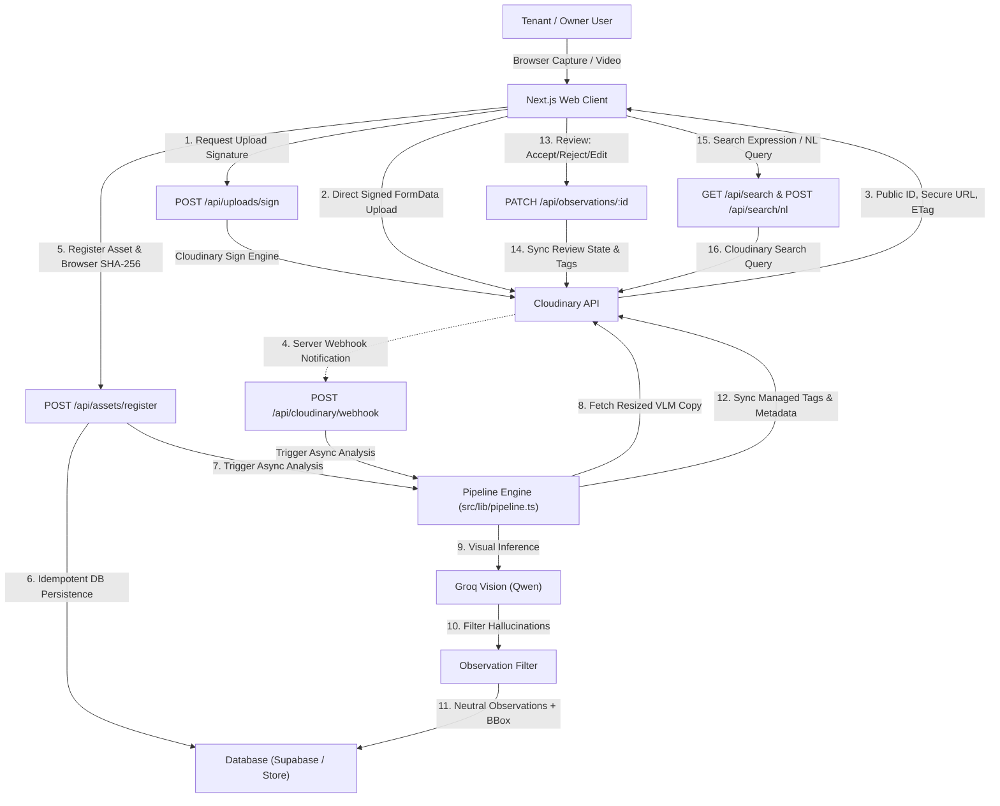

# RentalMove

> **"Capture once. Find instantly. Compare over time."**  
> Hackathon Submission for **Pixels to Products: Cloudinary AI Hackathon 2026**  
> **Track 1: AI Media Pipelines**

RentalMove turns property inspection photos into a structured, searchable, reviewable **visual property memory**. By uniting **Cloudinary's media pipeline** (direct signed uploads, dynamic transformations, structured metadata, search indexing, face anonymisation, and URL evidence rendering) with assistive Vision-Language AI models, RentalMove establishes trust and transparency between tenants and property owners while preserving absolute media integrity.

---

## 1. Product Overview

RentalMove anchors property condition across the entire lease lifecycle:
- **Move-In**: Establishes an unalterable visual baseline with SHA-256 content hashes and Cloudinary ETags.
- **Periodic Inspection**: Tracks wear and maintenance changes over time.
- **Move-Out**: Compares departure condition directly against baseline evidence with matched crop comparisons and split-slider diff tooling.

### User Roles
RentalMove supports two core roles with tailored dashboards and access boundaries:
1. **Tenant** (e.g. *Alex Chen*):
   - Accesses assigned property (#381 Elmwood Ave).
   - Captures and uploads real inspection photos and walkthrough video directly from the browser into Cloudinary.
   - Reviews AI observations (Accept / Reject / Edit) with keyboard shortcuts.
   - Compares move-out captures against move-in baseline.
   - Generates and reviews inspection reports with tenant privacy protection.
2. **Owner** (e.g. *Sarah Jenkins*):
   - Views and manages property portfolio.
   - Creates new properties and configures dynamic room definitions.
   - Schedules periodic inspections.
   - Navigates chronological property timelines and room history.
   - Conducts multi-inspection visual comparisons.
   - Executes natural language queries and structured searches across Cloudinary media assets.
   - Generates, shares, and revokes secure time-limited inspection evidence links.
   - Inspects live Cloudinary asset parameters with the dynamic **"Under the Hood"** drawer.

---

## 2. Architecture & Pipeline



---

## 3. Cloudinary as the Media Pipeline (Track 1)

Rather than treating Cloudinary as passive cloud storage, RentalMove makes Cloudinary the active compute engine across four critical workflows:

| Capability | File Location | Cloudinary Transformation / Implementation |
|---|---|---|
| **Direct Signed Uploads** | [`src/lib/media.ts`](src/lib/media.ts), [`src/app/capture/page.tsx`](src/app/capture/page.tsx) | Uploads images & videos directly from browser to Cloudinary via HMAC-SHA256 signed FormData. Never exposes `CLOUDINARY_API_SECRET`. |
| **Upload-Triggered Processing** | [`src/app/api/cloudinary/webhook/route.ts`](src/app/api/cloudinary/webhook/route.ts) | Cloudinary webhook notification triggers analysis when photos land in Cloudinary, so processing is host-resilient and never drops uploads. |
| **Matched Comparison Normalisation** | [`src/lib/cloudinary-urls.ts`](src/lib/cloudinary-urls.ts), [`src/lib/vision.ts`](src/lib/vision.ts) | Normalises both baseline and current captures with `c_fill,g_auto,w_1600,h_1200,e_auto_brightness,e_auto_contrast` before comparison, eliminating false positives from lighting shifts. Supports 2x2 quadrant tile extraction (`c_crop`). |
| **Evidence Overlay Renditions** | [`src/lib/cloudinary-urls.ts`](src/lib/cloudinary-urls.ts), [`src/app/report/page.tsx`](src/app/report/page.tsx) | Cloudinary renders hollow bounding boxes and category chips directly into the delivery URL (`l_rentalmove_ui:px,w_...,h_...,fl_relative/l_text:Arial_28_bold:...`), generating authentic evidence images rather than CSS overlays. |
| **Tenant Privacy Anonymisation** | [`src/lib/cloudinary-urls.ts`](src/lib/cloudinary-urls.ts), [`src/app/report/page.tsx`](src/app/report/page.tsx) | Automatically applies `e_pixelate_faces:20` to all shared reports and tokenized links, safeguarding tenant and family privacy during move-out disputes. |
| **Structured Metadata & Tag Indexing** | [`src/lib/tags.ts`](src/lib/tags.ts), [`src/lib/search.ts`](src/lib/search.ts) | Maintains bidirectional sync between database state and Cloudinary tags (`room:*`, `insp:*`, `issue:*`, `review:*`, inspection year) for instant Lucene search indexing. |
| **Integrity & Verification** | [`src/lib/hash.ts`](src/lib/hash.ts), [`src/app/capture/page.tsx`](src/app/capture/page.tsx) | Pairs genuine Cloudinary ETags (content hashes) with client-side SHA-256 digests computed directly from raw file bytes. |
| **Developer Drawer ("Under the Hood")** | [`src/components/UnderTheHoodDrawer.tsx`](src/components/UnderTheHoodDrawer.tsx) | Live drawer displaying Cloudinary public IDs, transformation URLs, ETags, SHA-256 hashes, and tags for any asset in the system. |

---

## 4. AI Stance & Guardrails

RentalMove enforces strict assistive ethics in [`src/lib/copy.ts`](src/lib/copy.ts) and [`src/lib/observation-filter.ts`](src/lib/observation-filter.ts):
- **Assistive Observations Only**: Vision models produce neutral descriptions (*"Possible visible mark on lower cabinet surface"*).
- **Anti-Hallucination Filtering**: Drops whole-photo bounding boxes (>70% area), boxes covering <0.04% area, and negative statements (*"no visible damage"* is not an observation).
- **Zero Financial / Blame Adjudication**: Strictly filters out terms like *fault, deposit penalty, guilty, damage deduction*.
- **Original Media Immutable**: Original uploads are preserved immutably. Transformations and overlays are rendered on-demand by Cloudinary.
- **Human-in-the-Loop**: All AI observations default to `pending` review.

---

## 5. Environment Variables

Create `.env.local` using `.env.example` as a template:

```bash
# Cloudinary Credentials (Required)
CLOUDINARY_CLOUD_NAME=your_cloud_name
CLOUDINARY_API_KEY=your_cloudinary_api_key_here
CLOUDINARY_API_SECRET=your_cloudinary_api_secret_here
NEXT_PUBLIC_CLOUDINARY_CLOUD_NAME=your_cloud_name
CLOUDINARY_NOTIFICATION_URL=https://your-deployment-url/api/cloudinary/webhook

# AI Vision & Natural Language Provider (Groq / Qwen Vision)
VISION_PROVIDER=groq
VISION_MODEL=qwen/qwen3.8-27b
GROQ_API_KEY=your_groq_api_key_here

# Supabase Database (Connected with fallback store support)
NEXT_PUBLIC_SUPABASE_URL=https://your-project.supabase.co
NEXT_PUBLIC_SUPABASE_ANON_KEY=your_anon_key_here
SUPABASE_SERVICE_ROLE_KEY=your_service_role_key_here

# App URL
NEXT_PUBLIC_APP_URL=http://localhost:3000
```

---

## 6. Setup & Seeding

### 1. Install Dependencies
```bash
npm install
```

### 2. Provision Cloudinary Metadata Fields
Configures the typed structured metadata schema fields and UI pixel in Cloudinary:
```bash
npx tsx scripts/provision-cloudinary.ts
```

### 3. Seed Realistic Photographic Demo Assets
Uploads high-resolution photographic property assets into Cloudinary, runs genuine Groq Vision inference, filters findings, syncs tags, and seeds the database:
```bash
npx tsx scripts/seed-demo-assets.ts
```

### 4. Run Development Server
```bash
npm run dev
```
Open [http://localhost:3000](http://localhost:3000).

---

## 7. Testing & Verification

Run the full Vitest suite (40 tests across 7 test suites):
```bash
npx vitest run
```

Run TypeScript compilation check:
```bash
npx tsc --noEmit
```

Run production build:
```bash
npm run build
```

---

## 8. Demo Credentials & Hackathon Walkthrough Flow

### Demo Users (Pre-seeded in Navbar Switcher)
- **Tenant**: `alex.tenant@rentalmove.demo` (Alex Chen)
- **Owner**: `sarah.owner@rentalmove.demo` (Sarah Jenkins)

### Hackathon Walkthrough Steps
1. **Tenant Experience**:
   - Open Landing page (`/`), toggle to **Tenant (Alex Chen)** in top-right.
   - View assigned property **#381 Elmwood Ave** with baseline status and pending observations.
   - Navigate to **Capture / Upload** (`/capture`), upload a photo, observe the direct Cloudinary upload, SHA-256 calculation, and pipeline execution.
   - Open **Review Center** (`/review`), use keyboard shortcuts (`A` Accept, `R` Reject, `E` Edit) to review observations. Notice Cloudinary tags update instantly.
   - Open **Compare** (`/compare`), select Kitchen baseline vs move-out to view the matched normalisation and split-screen comparison.
   - Open **Timeline** (`/timeline`), inspect chronological history from 2024 to 2026.
2. **Owner Experience**:
   - Switch role to **Owner (Sarah Jenkins)** in top-right.
   - Inspect portfolio, navigate to **Search** (`/search`), enter natural language query *"Show kitchen scratches from move in"* or filter by year *"2024"* to view real Cloudinary Search API results.
   - Click **Generate Report** on property #381, click **Share Report** to create a secure share link token.
   - Open share link (`/report?token=demo-token-9842f1a`) to view the report with **tenant face pixelation** and **Cloudinary-drawn evidence bounding boxes**.
   - Click **Under the Hood** in the top navigation bar to inspect real Cloudinary asset parameters, transformation URLs, and tags.
