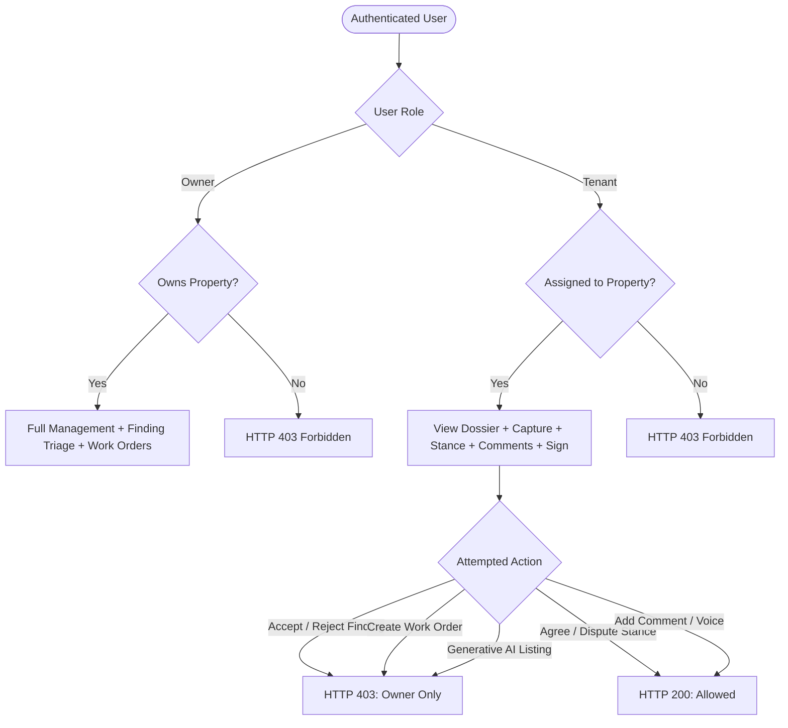
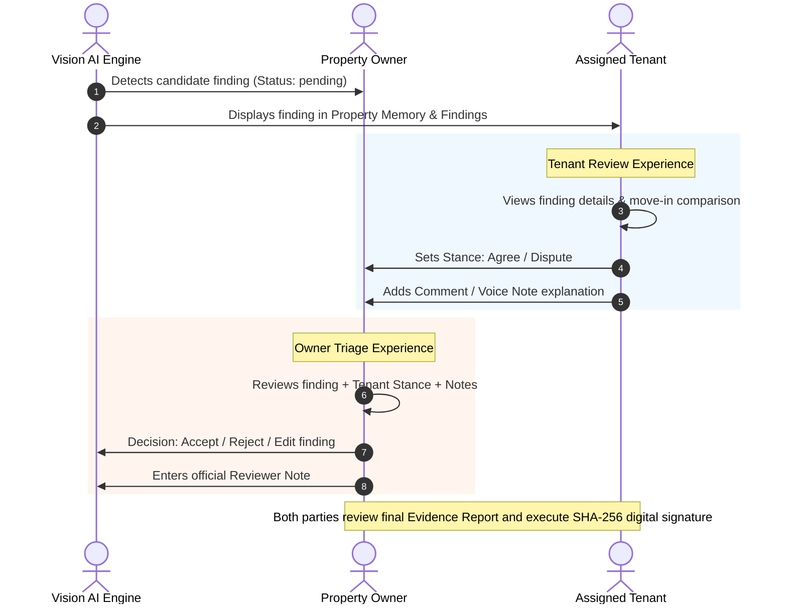

# RENTALMOVE — ROLE / FEATURE / ACTION / UI PERMISSION FORENSIC AUDIT
**Document Type:** Authoritative Permission Specification & Gap Audit Report  
**Audit Mode:** Read-Only Forensic Discovery (Zero Code/Data Modifications Applied)  
**Target System:** RentalMove Visual Property Memory Application  
**Framework Stack:** Next.js 15.5.26, Supabase PostgreSQL with RLS, Cloudinary Media Engine, Groq Vision  

---

## 1. Executive Summary

During testing of the finding review workflow, a critical UX/authorization mismatch occurred:
- A user authenticated with `role = "tenant"` navigated to `/review`, inspected an observation, and clicked **"Accept"** (or **"Reject"** / **"Edit"**).
- The client component triggered `review()` in `src/components/providers.tsx`, calling `PATCH /api/observations/[id]`.
- The backend API route strictly enforced owner authorization (`if (user.role !== "owner") return forbiddenResponse(...)`), returning `HTTP 403 Forbidden`.
- The client optimistic update rolled back, and an error toast was presented: `"Review not saved: Only property owners can review or edit findings."`

### Root Cause Analysis of the Triggering Issue
1. **Component Role-Unawareness:** `src/app/(studio)/review/page.tsx` line 27 destructures `{ observations, review, toast }` from `useStudio()`. It **does not even read `user` or `user.role`**. The Accept, Reject, Edit buttons and keyboard shortcuts (`A`, `R`, `E`) are unconditionally rendered for any authenticated user.
2. **Navigation Exposure:** `src/components/shell.tsx` line 21 lists `{ href: "/review", label: "Review", icon: ScanSearch, badge: true }` in `NAV`. The sidebar renders this link for all roles without any permission guard, including a badge counting pending findings.
3. **Command Palette & Shortcut Exposure:** `src/components/shell.tsx` exposes pending findings in the command palette (`⌘K`) linking directly to `/review?o=${o.id}` and registers global hotkeys `G then R` and `A / R / E`.
4. **Architectural Intent vs. UI Implementation:** The underlying product architecture explicitly defines **Finding Triage/Review** (accepting/rejecting findings into the legal evidence report) as an **Owner-only administrative action**. Conversely, the **Tenant's role** on a finding is designed around **Stance & Bilateral Discussion** (`agree` / `dispute`, adding comments, recording voice notes via `Parties` in `src/components/parties.tsx`). Because `/review/page.tsx` failed to contextualize the view for the tenant, the tenant was shown owner decision buttons rather than a review status summary with their stance controls.

Across the wider codebase, this forensic audit identified **28 distinct features**, spanning **64 unique actions**, revealing systemic patterns of:
- **Case A (UI visible, API denied):** 4 major instances (Finding Review/Accept/Reject/Edit, Room Creation via API, Re-let Generative Transformations, Work Order Management buttons in Review).
- **Case F (UI visible to tenant, but feature conceptually belongs to owner):** Re-let Studio navigation and page access, Review navigation link with badge.
- **Architectural Divergence (API vs RLS):** The backend database access layer (`getDatabase()`) operates via `SUPABASE_SERVICE_ROLE_KEY`, bypassing PostgreSQL RLS entirely. Consequently, database RLS does not protect against missing API authorization checks.

---

## 2. Complete Feature Inventory

| ID | Feature Name | Description | Primary Route / Surface | Underlying Tech / Services |
|---|---|---|---|---|
| F-01 | **User Authentication & Session** | Sign up, email/password login, JWT refresh, session retrieval, sign out | `/login`, `/signup`, Edge Middleware | Supabase Auth, `@supabase/ssr` cookies |
| F-02 | **Property Selection & Overview** | Multi-property selector, hero card, property status, stats, summary metrics | `/`, `/` (Studio) | Next.js Server & Client, DB `properties` |
| F-03 | **Room Navigation & Dossier** | Room card selection, dossier, room metadata, area specs | `/rooms/[id]`, `/map` | DB `rooms`, `lib/floorplan` |
| F-04 | **Room Creation** | Adding a new room category/name to a property | API only (`POST /api/properties/[id]/rooms`) | DB `rooms` |
| F-05 | **Camera & Photo Capture** | Live WebRTC camera viewfinder, alignment grid, move-in ghost overlay, shutter | `/capture` | HTML5 `getUserMedia`, Canvas |
| F-06 | **Direct Photo Upload** | Drag & drop or file picker upload of original image files | `/capture` | File API, Client SHA-256 |
| F-07 | **Phone QR Handoff** | Generating QR code on desktop to capture via mobile device without login | `/capture` modal, `/h/[token]` | HMAC-signed token, WebRTC/Mobile browser |
| F-08 | **Inspection Lifecycle** | Creating move-in, periodic, or move-out inspection containers | `/capture` details drawer | DB `inspections` |
| F-09 | **Asset Registration & Signing** | Server-side upload parameter signing, registration of Cloudinary asset in DB | `/capture`, API `/api/uploads/sign`, `/api/assets/register` | Cloudinary API, DB `assets` |
| F-10 | **AI Damage Detection Pipeline** | Async vision pipeline: Cloudinary perceptual fingerprint -> Groq Vision AI -> Pixel Grounding | Background Worker / API `/api/assets/[id]/analyze` | Groq Qwen Vision (`qwen3.8-27b`), Cloudinary |
| F-11 | **Analysis Manual Retry** | Manual re-triggering of failed or retryable vision analysis | `/capture`, `/lab`, API `/api/assets/[id]/analyze` | Pipeline recovery service |
| F-12 | **Reused Photo Detection** | Detect duplicate or re-uploaded photos via perceptual hash (pHash) distance | `/capture`, `/memory`, DB `assets` | Cloudinary phash, `lib/fingerprint.ts` |
| F-13 | **Pixel Comparison Engine** | Multi-mode image comparison (Slider, Side-by-Side, Onion Skin, Pixel Diff) | `/compare` | Canvas pixel comparison, normalized exposure |
| F-14 | **Room Time Machine** | Multi-visit historical scrubber blending photos over time with bounding box animation | `/rooms/[id]` | RequestAnimationFrame, CSS opacity blend |
| F-15 | **Finding Review & Triage** | Filtering findings (new vs pre-existing), accepting/rejecting findings into report | `/review` | DB `observations`, Cloudinary Managed Tags |
| F-16 | **Reviewer Notes & Editing** | Editing category, description, and adding human reviewer notes | `/review` | DB `observations` |
| F-17 | **Bilateral Stances (Positions)** | Recording "agree" or "dispute" positions on findings by role | `/review`, `Parties` component | Event store `rm_events` (type: `stance`) |
| F-18 | **Finding Discussions & Comments** | Multi-party threaded discussion on individual findings | `/review`, `Parties` component | Event store `rm_events` (type: `comment`) |
| F-19 | **Voice Notes** | Recording audio clips, uploading with Cloudinary signature, playback | `/review`, `Parties` component | MediaRecorder API, Cloudinary raw audio |
| F-20 | **Repair Work Orders** | Creating repair tickets, updating status, cancel, attach repair photo proof | `/repairs`, `/review` (`RepairPanel`) | Event store `rm_events` (type: `workorder`) |
| F-21 | **Evidence Report Generation** | Dynamic compile of accepted findings, cover, appendix, PDF print preview | `/report` | Server snapshot, CSS Print Media |
| F-22 | **Cryptographic Report Signing** | Bilateral digital sign-off on canonical report content hash (SHA-256) | `/report` | Crypto SHA-256 digest, `rm_events` |
| F-23 | **Multilingual Machine Translation** | On-demand translation of report finding texts into Hindi | `/report`, API `/api/translate` | Groq LLM translation, Cache |
| F-24 | **Expiring Share Links** | Generating unguessable 256-bit tokenized links with watermark recipient tracing | `/report`, `/r/[token]` | DB `share_links`, Cloudinary dynamic overlay |
| F-25 | **Share Link Revocation** | Immediate invalidation of public access links | `/report`, API `/api/share/[token]` | DB `share_links` update |
| F-26 | **Public Photo Verification** | Zero-knowledge client-side file hash verification against immutable DB records | `/verify`, API `/api/verify` | Local WebCrypto SHA-256, DB index lookup |
| F-27 | **Re-let Marketing Studio** | Transforming move-out evidence into listing photos via generative fill & enhancement | `/relet` | Cloudinary Generative AI (`gen_remove`, etc.) |
| F-28 | **Media Lab & Strict Transformations** | Interactive URL transformation laboratory testing image filters & quality presets | `/lab` | Server-signed Cloudinary recipes |

---

## 3. Master Role/Action Matrix

### Evaluation Terminology
- **ALLOW:** Action permitted without restriction.
- **DENY:** Action forbidden (returns HTTP 401 or 403; UI blocked).
- **OWNER_ONLY:** Action restricted strictly to property owners.
- **PROPERTY_MEMBER:** Action permitted to both Owner and Assigned Tenant of that property.
- **CREATOR_ONLY:** Action restricted strictly to the user who created the resource.
- **PUBLIC:** Unauthenticated public access permitted.
- **HIDDEN:** UI control completely absent from the DOM.
- **DISABLED:** UI control rendered in a non-interactive, disabled state.
- **MISMATCH:** Inconsistency between UI presentation, API enforcement, and/or database RLS.

| Feature | Action / Operation | Unauthenticated | Tenant (Assigned) | Owner (Property) | UI State | API Enforcement | Database / RLS | Alignment Status |
|---|---|---|---|---|---|---|---|---|
| **Auth** | Sign up | ALLOW | DENY (redirect) | DENY (redirect) | Form visible on `/signup` | ALLOW (rate-limited) | `handle_new_auth_user` trigger | Aligned |
| **Auth** | Sign in | ALLOW | DENY (redirect) | DENY (redirect) | Form visible on `/login` | ALLOW (rate-limited) | Supabase Auth verify | Aligned |
| **Auth** | Sign out | DENY (401) | ALLOW | ALLOW | Visible in topbar avatar menu | ALLOW (`DELETE /api/auth/session`) | Clears session cookies | Aligned |
| **Property** | View Property Details | DENY (redirect) | PROPERTY_MEMBER | PROPERTY_MEMBER | Visible in Overview & Shell | `canUserAccessProperty` | `properties_select` | Aligned |
| **Property** | Create New Property | DENY (401) | DENY | OWNER_ONLY | Hidden from UI | `user.role === "owner"` | RLS allows Owner insert | Aligned (No UI button) |
| **Rooms** | View Room Dossier | DENY (redirect) | PROPERTY_MEMBER | PROPERTY_MEMBER | Visible in `/rooms/[id]` | `canUserAccessProperty` | `rooms_select` | Aligned |
| **Rooms** | Create Room | DENY (401) | DENY | OWNER_ONLY | **NOT IN UI** | `user.role === "owner"` | `rooms_owner_write` | **Case B** (API exists, no UI) |
| **Inspections**| View Inspections | DENY (redirect) | PROPERTY_MEMBER | PROPERTY_MEMBER | Visible on Timeline & Capture | `canUserAccessProperty` | `inspections_select` | Aligned |
| **Inspections**| Create Inspection | DENY (401) | PROPERTY_MEMBER | PROPERTY_MEMBER | Visible in `/capture` details | `canUserAccessProperty` | `inspections_owner_write` (RLS Owner-only) | **API/RLS Divergence** |
| **Capture** | View Viewfinder / Stepper | DENY (redirect) | PROPERTY_MEMBER | PROPERTY_MEMBER | Visible on `/capture` | N/A (Client view) | N/A | Aligned |
| **Capture** | Request Upload Signature | DENY (401) | PROPERTY_MEMBER | PROPERTY_MEMBER | Triggered on capture/file | `canUserAccessProperty` | Service role backend | Aligned |
| **Capture** | Register Uploaded Asset | DENY (401) | PROPERTY_MEMBER | PROPERTY_MEMBER | Auto-called after upload | `canUserAccessProperty` | `assets_owner_write` (RLS Owner-only) | **API/RLS Divergence** |
| **Handoff** | Generate QR Handoff | DENY (401) | PROPERTY_MEMBER | PROPERTY_MEMBER | Button in `/capture` header | `canUserAccessProperty` | HMAC Signed Token | Aligned |
| **Handoff** | Open Phone Capture | PUBLIC (Token) | PUBLIC (Token) | PUBLIC (Token) | Mobile interface `/h/[token]` | `verifyHandoff` token | Token validated | Aligned |
| **Handoff** | Upload via Phone | PUBLIC (Token) | PUBLIC (Token) | PUBLIC (Token) | Mobile shutter button | HMAC verified folder scope | Service role backend | Aligned |
| **Analysis**| Run / Retry Vision AI | DENY (401) | PROPERTY_MEMBER | PROPERTY_MEMBER | Auto / Manual retry | `canUserAccessProperty` | Service role backend | Aligned |
| **Comparison**| View Comparison Modes | DENY (redirect) | PROPERTY_MEMBER | PROPERTY_MEMBER | Visible on `/compare` | N/A (Client snapshot) | N/A | Aligned |
| **Comparison**| Execute Comparison API | DENY (401) | PROPERTY_MEMBER | PROPERTY_MEMBER | "Run comparison" button | `canUserAccessProperty` | `comparisons_access` | Aligned |
| **Time Machine**| Scrub Room History | DENY (redirect) | PROPERTY_MEMBER | PROPERTY_MEMBER | Slider on `/rooms/[id]` | N/A (Client animation) | N/A | Aligned |
| **Review** | View Finding Details | DENY (redirect) | PROPERTY_MEMBER | PROPERTY_MEMBER | Visible in `/review` | Snapshot authorized | `observations_select` | Aligned |
| **Review** | Accept Finding | DENY (401) | **DENY** | **OWNER_ONLY** | **VISIBLE TO TENANT** | `user.role === "owner"` | `observations_owner_update` | **CASE A MISMATCH** |
| **Review** | Reject Finding | DENY (401) | **DENY** | **OWNER_ONLY** | **VISIBLE TO TENANT** | `user.role === "owner"` | `observations_owner_update` | **CASE A MISMATCH** |
| **Review** | Edit Category/Text | DENY (401) | **DENY** | **OWNER_ONLY** | **VISIBLE TO TENANT** | `user.role === "owner"` | `observations_owner_update` | **CASE A MISMATCH** |
| **Review** | Save Reviewer Note | DENY (401) | **DENY** | **OWNER_ONLY** | **VISIBLE TO TENANT** | `user.role === "owner"` | `observations_owner_update` | **CASE A MISMATCH** |
| **Positions**| Post Stance (Agree/Dispute)| DENY (401) | PROPERTY_MEMBER | PROPERTY_MEMBER | Visible in `Parties` component | `observationWithProperty` | Event store insert | Aligned |
| **Comments** | Post Text Comment | DENY (401) | PROPERTY_MEMBER | PROPERTY_MEMBER | Visible in `Parties` component | `observationWithProperty` | Event store insert | Aligned |
| **Comments** | Upload Voice Note | DENY (401) | PROPERTY_MEMBER | PROPERTY_MEMBER | Mic button in `Parties` | `checkVoiceClip` + property | Cloudinary raw upload | Aligned |
| **Repairs** | View Repair Board | DENY (redirect) | PROPERTY_MEMBER | PROPERTY_MEMBER | Visible in `/repairs` & Review | Derived from events | Event store read | Aligned |
| **Repairs** | Create Work Order | DENY (401) | **DENY** | **OWNER_ONLY** | **Conditionally hidden** | `OWNER_ONLY.has("create")` | Event store insert | Aligned in UI |
| **Repairs** | Change Repair Status | DENY (401) | **DENY** | **OWNER_ONLY** | **Conditionally hidden** | `OWNER_ONLY.has("status")` | Event store insert | Aligned in UI |
| **Repairs** | Upload Repair Proof Photo| DENY (401) | PROPERTY_MEMBER | PROPERTY_MEMBER | "Add repair photo" button | Action `sign`/`photo` allowed | Event store insert | Aligned |
| **Report** | View Report & Print | DENY (redirect) | PROPERTY_MEMBER | PROPERTY_MEMBER | Visible on `/report` | Server snapshot | N/A | Aligned |
| **Report** | Sign Report (SHA-256) | DENY (401) | PROPERTY_MEMBER | PROPERTY_MEMBER | "Sign as you" button | `canUserAccessProperty` | Event store signature | Aligned |
| **Report** | Withdraw Signature | DENY (401) | CREATOR_ONLY | CREATOR_ONLY | "Withdraw" button | `canUserAccessProperty` | Event store signature | Aligned |
| **Report** | Translate into Hindi | DENY (401) | PROPERTY_MEMBER | PROPERTY_MEMBER | Language toggle on `/report` | `canUserAccessProperty` | Event store translation | Aligned |
| **Report** | Create Share Link | DENY (401) | PROPERTY_MEMBER | PROPERTY_MEMBER | Form on `/report` | `canUserAccessProperty` | DB `share_links` insert | Aligned |
| **Report** | Revoke Share Link | DENY (401) | CREATOR_ONLY | OWNER_OR_CREATOR| Revoke button on active link | Creator or Owner check | DB `share_links` update | Aligned |
| **Report** | View Public Share Link | PUBLIC (Token) | PUBLIC (Token) | PUBLIC (Token) | Direct URL `/r/[token]` | Valid token + unexpired | `share_links_select` | Aligned |
| **Verify** | Public Hash Check | PUBLIC | PUBLIC | PUBLIC | `/verify` search box | No auth required | `assets(sha256)` index | Aligned |
| **Re-let** | Access Re-let Page | DENY (redirect) | **DENY (CONCEPT)**| **OWNER_ONLY** | **Link in NAV; empty card** | N/A (Client renders Empty) | N/A | **CASE F MISMATCH** |
| **Re-let** | Generate AI Listing Images| DENY (401) | **DENY** | **OWNER_ONLY** | Controls in `/relet` | `isGenerative && role!=owner`| Cloudinary signed recipe | Aligned in API |
| **Media Lab**| Test Transformations | DENY (redirect) | PROPERTY_MEMBER | PROPERTY_MEMBER | Visible on `/lab` | Non-generative sign allowed | N/A | Aligned |
| **System** | Cloudinary Webhook | PUBLIC (Signed)| PUBLIC (Signed) | PUBLIC (Signed) | Background endpoint | HMAC signature verify | Service role backend | Aligned |

---

## 4. Owner Permissions

Property owners possess full custodial authority over the properties they own:
1. **Property Configuration:** Authorized to create properties, define architectural rooms, and assign tenants.
2. **Finding Decision Authority (Triage):** Sole authority to formally review damage findings generated by the AI vision pipeline (`review_status`: `accepted`, `rejected`, `edited`), set reviewer notes, and modify finding descriptions.
3. **Repair Management:** Sole authority to create repair work orders, assign contractors, set due dates, advance work order status (`open` -> `in_progress` -> `done`), and re-open completed work orders.
4. **Marketing & Re-let:** Exclusive permission to trigger generative AI transformations on move-out photos (credit-consuming Cloudinary operations that alter pixels and burn `AI-ALTERED` watermarks).
5. **Universal Link Governance:** Authority to revoke any active public share link associated with their property, regardless of which user created the link.
6. **Bilateral Sign-off:** Ability to execute or withdraw owner cryptographic signatures against the canonical report content hash.

---

## 5. Tenant Permissions

Tenants possess legitimate tenancy-bound rights on the property assigned to them:
1. **Property & Room Inspection:** Authorized to inspect all rooms, photos, floor plan heat maps, and condition histories for their assigned property.
2. **Move-in / Move-out Capture:** Authorized to capture inspection photos using live camera, photo upload, or desktop-to-mobile QR handoff.
3. **Bilateral Stances on Findings:** Fully empowered to register their position on every individual finding (`agree` = agrees damage is a change; `dispute` = contests the finding description or pre-existing status).
4. **Discussion & Evidence Contribution:** Permitted to contribute text comments and voice notes to finding discussion threads.
5. **Repair Proof Contribution:** Permitted to upload photos proving that a requested repair has been completed.
6. **Independent Evidence Sharing:** Authorized to generate expiring, watermarked share links (e.g. to furnish proof to tenancy deposit dispute services) and revoke links they personally generated.
7. **Bilateral Report Sign-off:** Authorized to sign the condition evidence report content hash using their authenticated identity.

---

## 6. Public Permissions

Unauthenticated actors have tightly controlled, strictly zero-knowledge access:
1. **Public Photo Verification (`/verify`):** Any member of the public can select a local photo file. The browser computes SHA-256 locally. The hash is looked up via `POST /api/verify`. If matched, the API returns only metadata (`room name`, `inspection type`, `captured_at`, `registered_at`). **It never reveals property address, unit number, tenant name, or owner identity.**
2. **Tokenized Report Access (`/r/[token]`):** Anyone with an unexpired, unrevoked 256-bit cryptographically random token can view a compiled, read-only version of the report. The API delivers only reviewed/accepted findings with privacy-pixelated images and recipient watermarks. Raw inspection events, pending findings, rejected findings, and private reviewer notes are completely excluded.
3. **HMAC Mobile Handoff (`/h/[token]`):** Mobile browser access granted via a 15-minute cryptographically signed HMAC token for capturing a single specific room.

---

## 7. Conditional Permissions

Access rules governed by compound relationships:



- **Revoking Share Links:** User must either be the specific creator (`link.created_by === user.id`) OR the property owner (`user.role === "owner" && canUserAccessProperty`).
- **Withdrawing Report Signatures:** A user can only withdraw their own role's signature (`actor_id: user.id`).
- **Media Delivery Signing (`POST /api/media/sign`):** Non-generative transformations (tiles, lab adjustments) are allowed for any property participant; generative listing transformations (`isGenerative(recipe)`) strictly require `user.role === "owner"`.

---

## 8. Data Visibility Matrix

| Data Field / Entity | Tenant (Assigned) | Owner (Property) | Public (Share Token) | Public (Verify) |
|---|---|---|---|---|
| Property Address & Unit | Visible | Visible | Visible | **HIDDEN** |
| Room Names & Floor Plans | Visible | Visible | Visible | Room Name Only |
| Unreviewed (Pending) Findings | Visible | Visible | **HIDDEN** | **HIDDEN** |
| Rejected Findings | Visible | Visible | **HIDDEN** | **HIDDEN** |
| Accepted / Edited Findings | Visible | Visible | Visible | **HIDDEN** |
| Reviewer Internal Notes | Visible | Visible | Visible in Report | **HIDDEN** |
| AI Vision Confidence Scores | Visible | Visible | **HIDDEN** | **HIDDEN** |
| Original High-Res Image URLs | Visible | Visible | **HIDDEN (Derived only)**| **HIDDEN** |
| Pixelated Face Derivatives | Visible | Visible | Enforced by default | **HIDDEN** |
| Tenant Stances (`agree`/`dispute`) | Visible | Visible | Visible in Appendix | **HIDDEN** |
| Owner Stances (`agree`/`dispute`) | Visible | Visible | Visible in Appendix | **HIDDEN** |
| Finding Comments & Voice Clips | Visible | Visible | **HIDDEN** | **HIDDEN** |
| Work Order Financial / Assignee | Visible | Visible | Status & Photo only | **HIDDEN** |
| Audit Trail (`rm_events`) | Visible in Activity | Visible in Activity | **HIDDEN** | **HIDDEN** |
| Property Share Link List | **EMPTY ARRAY `[]`** | Full List & Tokens | **HIDDEN** | **HIDDEN** |
| SHA-256 Photo Hashes | Visible | Visible | Visible in Appendix | Looked up via Hash |

---

## 9. UI Visibility Matrix

Audit of navigation surfaces, command palettes, keyboard shortcuts, and cards across roles:

| UI Surface / Element | Current Tenant State | Current Owner State | Target Tenant State | Target Owner State |
|---|---|---|---|---|
| **Sidebar "Review" Nav Link** | Visible (with badge) | Visible (with badge) | **Visible (Label: "Findings")** | Visible (Label: "Review") |
| **Sidebar "Re-let Studio" Link** | Visible | Visible | **HIDDEN** | Visible |
| **Sidebar "Repairs" Link** | Visible (with open count)| Visible (with open count)| Visible (Read/Upload proof) | Visible (Manage repairs) |
| **Topbar "Under the hood" (U)** | Visible | Visible | Visible | Visible |
| **Topbar "Present" Tour** | Visible | Visible | Visible | Visible |
| **Command Palette "Review" Items** | Listed | Listed | **HIDDEN or re-routed** | Listed |
| **Command Palette "Re-let"** | Listed | Listed | **HIDDEN** | Listed |
| **Shortcut `G S` (Jump Re-let)** | Active (renders Empty) | Active | **Disabled** | Active |
| **Shortcut `G R` (Jump Review)** | Active | Active | Active (Opens Findings view) | Active |
| **Review Page: Accept Button** | **VISIBLE (Causes 403)** | Visible | **HIDDEN** | Visible |
| **Review Page: Reject Button** | **VISIBLE (Causes 403)** | Visible | **HIDDEN** | Visible |
| **Review Page: Edit Button** | **VISIBLE (Causes 403)** | Visible | **HIDDEN** | Visible |
| **Review Page: Reviewer Note Input**| **VISIBLE (Editable)** | Visible | **Read-Only / Disabled** | Visible |
| **Review Page: Hotkeys `A/R/E`** | **Active (Causes 403)** | Active | **Disabled** | Active |
| **Review Page: Stance Buttons** | Visible | Visible | Visible (Primary Action) | Visible |
| **Review Page: Repair Request** | Hidden (reads `isOwner`) | Visible | Hidden (shows status) | Visible |
| **Report Page: "Sign as you"** | Visible | Visible | Visible | Visible |
| **Report Page: Create Share Link**| Visible | Visible | Visible | Visible |

---

## 10. API Authorization Matrix

Comprehensive audit of all 34 backend API endpoints:

| Endpoint | Method | Auth Required | Role Required | Target Check Function | Status Code on Unauthorized |
|---|---|---|---|---|---|
| `/api/auth/session` | GET | Optional | Any | `getSessionUser` | 200 (null user) |
| `/api/auth/session` | DELETE | Required | Any | Session cookie clear | 200 |
| `/api/auth/signup` | POST | Public | Any | Schema validation | 400 / 409 |
| `/api/auth/profile` | POST | Required | Any | `getSessionUser` | 401 |
| `/api/properties` | GET | Required | Any | Scoped by `user.id, user.role` | 401 |
| `/api/properties` | POST | Required | `owner` | `user.role === "owner"` | 403 |
| `/api/properties/[id]` | GET | Required | Member | `canUserAccessProperty` | 403 |
| `/api/properties/[id]/rooms` | GET | Required | Member | `canUserAccessProperty` | 403 |
| `/api/properties/[id]/rooms` | POST | Required | `owner` | `user.role === "owner"` | 403 |
| `/api/properties/[id]/inspections` | GET | Required | Member | `canUserAccessProperty` | 403 |
| `/api/properties/[id]/inspections` | POST | Required | Member | `canUserAccessProperty` | 403 |
| `/api/properties/[id]/snapshot` | GET | Required | Member | `canUserAccessProperty` | 403 |
| `/api/properties/[id]/stream` | GET | Required | Member | `canUserAccessProperty` | 403 |
| `/api/properties/[id]/timeline` | GET | Required | Member | `canUserAccessProperty` | 403 |
| `/api/observations/[id]` | PATCH | Required | `owner` | `user.role === "owner"` | 403 |
| `/api/observations/[id]/stance` | POST | Required | Member | `observationWithProperty` | 403 |
| `/api/observations/[id]/comments` | POST | Required | Member | `observationWithProperty` | 403 |
| `/api/observations/[id]/voice` | POST | Required | Member | `observationWithProperty` | 403 |
| `/api/observations/[id]/workorder` | POST | Required | Conditional | `OWNER_ONLY` set check | 403 |
| `/api/assets/register` | POST | Required | Member | `canUserAccessProperty` | 403 |
| `/api/assets/[id]/analyze` | POST | Required | Member | `canUserAccessProperty` | 403 |
| `/api/assets/[id]/calibration` | POST | Required | Member | `assetWithProperty` | 403 |
| `/api/comparisons` | POST | Required | Member | `canUserAccessProperty` | 403 |
| `/api/uploads/sign` | POST | Required | Member | `canUserAccessProperty` | 403 |
| `/api/media/sign` | POST | Required | Conditional | `isGenerative -> owner` | 403 |
| `/api/report/sign` | POST | Required | Member | `canUserAccessProperty` | 403 |
| `/api/share` | POST | Required | Member | `canUserAccessProperty` | 403 |
| `/api/share/[token]` | GET | Public | Valid Token | Token lookup | 404 |
| `/api/share/[token]` | DELETE | Required | Creator/Owner | `isCreator \|\| isOwner` | 403 |
| `/api/report/[token]` | GET | Public | Redirect | 307 to `/api/share/[token]` | 307 |
| `/api/handoff` | POST | Required | Member | `canUserAccessProperty` | 403 |
| `/api/handoff/[token]/info` | GET | Public (HMAC) | Valid Token | `verifyHandoff` | 401 |
| `/api/handoff/[token]/sign` | POST | Public (HMAC) | Valid Token | `verifyHandoff` | 401 |
| `/api/handoff/[token]/register`| POST | Public (HMAC) | Valid Token | `verifyHandoff` | 401 |
| `/api/translate` | POST | Required | Member | `canUserAccessProperty` | 403 |
| `/api/search` | GET | Required | Member | `canUserAccessProperty` | 403 |
| `/api/search/nl` | POST | Required | Member | `canUserAccessProperty` | 403 |
| `/api/verify` | POST | Public | Any | Rate-limited hash check | 400 |
| `/api/cloudinary/webhook` | POST | Public (Signed)| Cloudinary | `verifyNotificationSignature` | 401 |

---

## 11. RLS Matrix

Database-level Row Level Security policy status as defined in migrations `0001`, `0002`, `0004`:

| Table | Operation | Target Roles / USING Expression | Service Role Bypass? | API vs RLS Status |
|---|---|---|---|---|
| `users` | SELECT | `id = auth.uid()::text` | Yes (`service_role_all_users`) | Aligned |
| `properties` | SELECT | `owner_id = auth.uid()` OR `property_tenants` | Yes (`service_role_all_properties`) | Aligned |
| `properties` | INSERT/UPDATE | `owner_id = auth.uid()` | Yes | Aligned |
| `rooms` | SELECT | Property Owner OR Assigned Tenant | Yes (`service_role_all_rooms`) | Aligned |
| `rooms` | INSERT/UPDATE | `owner_id = auth.uid()` (Owner only) | Yes | Aligned with API |
| `inspections` | SELECT | Property Owner OR Assigned Tenant | Yes (`service_role_all_inspections`) | Aligned |
| `inspections` | INSERT/UPDATE | `owner_id = auth.uid()` (Owner only) | Yes | **Divergence: API permits tenant** |
| `assets` | SELECT | Property Owner OR Assigned Tenant | Yes (`service_role_all_assets`) | Aligned |
| `assets` | INSERT/UPDATE | `owner_id = auth.uid()` (Owner only) | Yes | **Divergence: API permits tenant** |
| `observations` | SELECT | Property Owner OR Assigned Tenant | Yes (`service_role_all_observations`) | Aligned |
| `observations` | UPDATE | `p.owner_id = auth.uid()` (Owner only) | Yes | Aligned with API |
| `observations` | INSERT | `p.owner_id = auth.uid()` OR `service_role` | Yes | Aligned (Pipeline inserts via service role) |
| `observations` | DELETE | `p.owner_id = auth.uid()` (Owner only) | Yes | Aligned |
| `comparisons` | ALL | Property Owner OR Assigned Tenant | Yes (`service_role_all_comparisons`) | Aligned |
| `share_links` | SELECT | `revoked_at IS NULL AND expires_at > NOW()` | Yes (`service_role_all_share_links`) | Aligned |

---

## 12. UI/API Mismatches

### Detailed Analysis of Mismatch Classes

#### CASE A: UI Visible, API Denied (The Triggering Defect)
- **Component:** `src/app/(studio)/review/page.tsx` (Lines 281–287)
- **Visible Controls:**
  - Button `<button ...>Accept A</button>`
  - Button `<button ...>Reject R</button>`
  - Button `<button ...>Edit E</button>`
  - Input `Reviewer note` (Lines 270–273)
  - Keyboard listeners: `A`, `R`, `E`, `⌘+Enter` (Lines 95–97)
- **Cause:** No `user.role` evaluation exists in `Review()`.
- **API Response:** `PATCH /api/observations/[id]` rejects with `HTTP 403 Forbidden` (`"Only property owners can review or edit findings."`).
- **Effect:** Broken user experience; optimistic UI flutters and throws error toast.

#### CASE B: UI Hidden, API Allowed
- **Feature:** Room Creation (`POST /api/properties/[id]/rooms`)
- **Condition:** API strictly permits owners to create rooms, but there is no UI button or modal anywhere in the Studio to add a room once a property is set up.

#### CASE F: UI Visible to Tenant, Conceptual Owner Domain
- **Feature:** Re-let Studio (`src/app/(studio)/relet/page.tsx`)
- **Navigation:** Rendered as `Re-let studio` (`Wand2`) in the primary navigation sidebar for all users.
- **Page Behavior:** When tenant clicks, the page renders an `Empty` state saying `"Re-let studio is an owner tool"`.
- **Finding:** A tenant should not see marketing re-let tools in their daily property management navigation.

#### CASE G: Keyboard Shortcuts Bypass UI Visual State
- **Feature:** Finding decisions via hotkeys.
- **Condition:** Even if buttons were CSS-hidden without unbinding listeners, pressing `A`, `R`, or `E` in `/review` triggers `decide()`.
- **Navigation Shortcuts:** Pressing `G then S` jumps to `/relet` regardless of role.

#### CASE H: Command Palette Leakage
- **Feature:** Command palette (`src/components/shell.tsx` lines 184–185)
- **Condition:** Searches all pending observations and generates links:
  `...observations.filter(o => o.review_status === "pending").map(o => ({ group: "Pending observations", run: go('/review?o=' + o.id) }))`
  Tenants see a prompt to triage pending observations, guiding them into the failing workflow.

---

## 13. Security Gaps

1. **Service Role RLS Invalidation:**
   `getDatabase()` in `src/lib/db.ts` exclusively instantiates `SupabaseDatabaseService` using `SUPABASE_SERVICE_ROLE_KEY`. Because service-role calls bypass Postgres RLS, the database provides **zero safety net** if an API route fails to enforce `canUserAccessProperty` or `user.role`.
2. **Missing Rate Limiting on Finding Mutations:**
   While `/api/media/sign` and `/api/comparisons` have rate limits, `PATCH /api/observations/[id]` and `POST /api/observations/[id]/stance` lack explicit IP/session rate limits.
3. **Tenant Asset Registration Mismatch with RLS:**
   In `0004_tighten_rls_and_sha_index.sql`, `assets_owner_write` restricts `INSERT` on `assets` to owners. However, `/api/assets/register` permits tenants to register assets (essential for tenant self-capture). If scoped client architecture is enabled, tenant capture will break against Postgres RLS.

---

## 14. UX Gaps

1. **Absence of Dedicated Tenant Finding View:**
   When a tenant views `/review`, they need to see:
   - What the finding is (Description, Category, Bounding Box, Move-in Comparison).
   - What the owner decided (Review Status Badge, Reviewer Note).
   - Their own stance controls (**Agree** / **Dispute** buttons with prominent affordance).
   - The discussion thread (Comments, Voice notes).
   Instead, they currently see Owner decision controls (`Accept`, `Reject`, `Edit`) and have to scroll down to find the `Parties` component.
2. **Confusing Navigation Badge for Tenants:**
   The `Review` nav item displays a badge count of `pending` findings. For an owner, `pending` means "needs your decision". For a tenant, findings pending owner review are not actionable in the same way, creating false urgency.
3. **Dead End in Re-let Studio:**
   Navigating to `/relet` displays an empty card. Navigating to an owner-only tool should either redirect to `/` with an informative toast or be filtered out of the navigation entirely.

---

## 15. Missing Test Coverage

| Test Case Specification | Existing Test | File Location | Gap / Priority |
|---|---|---|---|
| Tenant rejected from `PATCH /api/observations/[id]` | **YES** | `tests/idor-auth.test.ts:108` | Covered |
| Unauthorized Owner rejected from observation update | **YES** | `tests/idor-auth.test.ts:138` | Covered |
| Authorized Owner allowed to update observation | **YES** | `tests/idor-auth.test.ts:168` | Covered |
| Tenant allowed to post stance (`/stance`) | **NO** | Missing | **HIGH** |
| Unauthorized user rejected from posting stance | **NO** | Missing | **HIGH** |
| Tenant allowed to post comment & voice | **NO** | Missing | **HIGH** |
| Tenant rejected from creating work order (`action: create`)| **NO** | Missing | **HIGH** |
| Tenant allowed to upload repair photo proof (`action: photo`)| **NO** | Missing | **MEDIUM** |
| Tenant rejected from generative Cloudinary recipes | **NO** | Missing | **HIGH** |
| Owner allowed generative Cloudinary recipes | **NO** | Missing | **MEDIUM** |
| Tenant rejected from creating rooms | **NO** | Missing | **HIGH** |
| Tenant permitted to create inspections for assigned property| **NO** | Missing | **MEDIUM** |
| UI Component Test: Review page hides Accept/Reject for tenant| **NO** | Missing | **CRITICAL** |
| UI Component Test: Shell hides Re-let Studio nav for tenant | **NO** | Missing | **HIGH** |
| UI Component Test: Review hotkeys `A/R/E` inert for tenant | **NO** | Missing | **CRITICAL** |

---

## 16. Proposed Target Permission Model

### Conceptual Role Definitions
- **OWNER:** Custodian and legal authority of the real property asset. Triages evidence, commissions repairs, controls re-letting, and signs formal reports.
- **TENANT:** Lawful occupant of an assigned property during an active tenancy. Performs move-in/move-out captures, takes bilateral stances on damage allegations, submits repair proof, and signs formal reports.
- **PUBLIC:** Third parties (courts, deposit adjudicators, incoming tenants) verifying cryptographic authenticity of photos or reports without accessing private records.

```
                    RENTALMOVE TARGET PERMISSION ARCHITECTURE

                     +-----------------------------------+
                     |           AUTHENTICATION          |
                     |  Supabase JWT / HttpOnly Cookie   |
                     +-----------------+-----------------+
                                       |
                     +-----------------v-----------------+
                     |       PROPERTY ACCESS GUARD       |
                     |     canUserAccessProperty()       |
                     +--------+-----------------+--------+
                              |                 |
             +----------------v----+       +----v----------------+
             |    ROLE: OWNER      |       |    ROLE: TENANT     |
             +----------+----------+       +----+----------------+
                        |                       |
       +----------------+----------------+      |
       |                |                |      |
+------v------+  +------v------+  +------v------v-----+  +---------------------+
|   FINDING   |  | WORK ORDERS |  |    EVIDENCE       |  |   BILATERAL STANCE  |
|   TRIAGE    |  |  MANAGEMENT |  |    CAPTURE        |  |     & COMMENTS      |
|Accept/Reject|  |Create/Status|  | Photo / Inspection|  |   Agree / Dispute   |
+------+------+  +------+------+  +------+------------+  +----------+----------+
       |                |                |                          |
+------v----------------v----------------v--------------------------v----------+
|                               API LAYER                                      |
|      Strict Role & Property Enforcements (e.g. user.role === "owner")        |
+------------------------------------------------------------------------------+
```

### Target Workflow Alignment for Findings



---

## 17. Implementation Dependencies

To implement this permission model cleanly without regressions:
1. **Unified Permission Hook / Utilities:** Create a declarative helper (e.g. `src/lib/permissions.ts` and `usePermissions()`) that exposes boolean capabilities (`canTriageFindings`, `canManageWorkOrders`, `canAccessRelet`, `canCreateRooms`).
2. **Review View Split:** Refactor `src/app/(studio)/review/page.tsx` to distinguish between `OwnerTriageControls` and `TenantStanceControls`.
3. **Shell Navigation Filtering:** Pass `user.role` into `NAV` item filtering in `src/components/shell.tsx` to suppress `Re-let Studio` for non-owners.
4. **Command Palette & Shortcut Guards:** Guard `A/R/E` shortcuts and filter command palette items by user capability.
5. **Database Migration Alignment:** Align migration `0004` to ensure `assets` and `inspections` RLS policies permit assigned tenants to insert rows if scoped client database operations are adopted.

---

## 18. Safe Implementation Order

When the subsequent implementation task begins, execution should strictly follow this sequence:

```
Phase 1: Declarative Capability Matrix (src/lib/permissions.ts)
   │
   ▼
Phase 2: Fix Review Page Mismatch (src/app/(studio)/review/page.tsx)
   ├─ Hide Accept/Reject/Edit and Reviewer Note from Tenant
   ├─ Elevate Agree/Dispute and Discussion for Tenant
   └─ Disable A/R/E keyboard hotkeys for non-owners
   │
   ▼
Phase 3: Shell & Navigation Hardening (src/components/shell.tsx)
   ├─ Filter NAV links by role (hide Re-let Studio for tenants)
   ├─ Relabel "Review" to "Findings" for tenants
   ├─ Filter Command Palette items by role
   └─ Guard G S shortcut for Re-let Studio
   │
   ▼
Phase 4: Route Protection & Redirects
   └─ Add server/client redirect on /relet for non-owners
   │
   ▼
Phase 5: Automated Regression Test Suite
   ├─ Vitest component tests for role-conditional UI rendering
   ├─ API tests for stance, comment, and work-order permission boundaries
   └─ End-to-end role verification tests
```

---
*Report compiled autonomously via read-only forensic inspection of RentalMove source code, migrations, tests, and runtime environment.*
